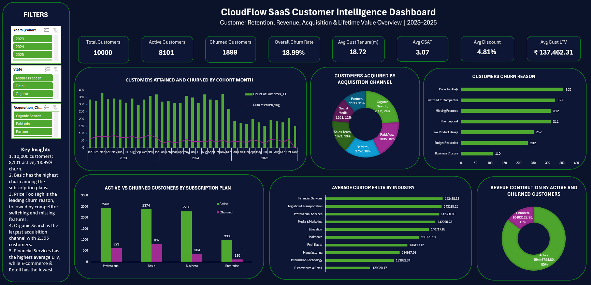

# SaaS Customer Intelligence Analysis

## 📌 Project Overview

SaaS companies need to understand not only how many customers they acquire, but also how well those customers are retained, how much recurring revenue they generate, and which acquisition channels bring long-term value.

This project analyzes a fictional India-based SaaS company, **CloudFlow**, using a single customer-level dataset containing 10,000 subscription records.

The analysis focuses on **customer churn and retention, recurring revenue, customer lifetime value (LTV), acquisition performance, and cohort behavior**, with the final findings presented through an interactive Excel dashboard.

---

## 🎯 Business Problem

CloudFlow wants to better understand the performance and sustainability of its customer base.

The analysis aims to answer questions such as:

- How many customers are currently active?
- What is the overall customer churn rate?
- Which subscription plans have higher churn?
- Why are customers leaving?
- How does customer satisfaction and product usage relate to retention?
- Which subscription plans generate the most recurring revenue?
- Which customer segments generate higher lifetime value?
- Which acquisition channels bring valuable customers?
- How does customer behavior vary across different customer cohorts?

---

## 🎯 Project Objectives

The project was designed around three main analytical areas:

### 1. Customer & Churn Analysis

Analyze customer retention and identify patterns associated with churn.

Key areas include:

- Active vs. churned customers
- Churn rate by subscription plan
- Churn by company size
- Churn reasons
- Customer satisfaction and retention
- Product usage and retention
- Cohort-level churn trends

### 2. Revenue & LTV Analysis

Understand recurring revenue and the long-term value generated by customers.

Key areas include:

- Net Monthly Recurring Revenue (MRR)
- Annualized revenue
- Customer Lifetime Revenue
- Average LTV by subscription plan
- Revenue contribution by customer segment
- Customer tenure and lifetime value

### 3. Acquisition & Cohort Analysis

Evaluate where customers come from and how customer cohorts perform over time.

Key areas include:

- Customer acquisition by channel
- Churn rate by acquisition channel
- Average LTV by acquisition channel
- Customer acquisition trends
- Cohort churn
- Cohort lifetime value

---

## 📊 Dataset

The project uses a single synthetic customer-level dataset containing:

- **10,000 customer records**
- **18 raw business columns**
- India-based customers
- Subscription and customer lifecycle information
- No intentional null values

### Key Dataset Fields

| Category | Fields |
|---|---|
| Customer Profile | Customer ID, Company Name, Industry, State, Employee Count |
| Acquisition | Acquisition Channel |
| Subscription | Subscription Plan, Start Date, Last Renewal Date, Subscription Valid Until |
| Revenue | Monthly Recurring Fee, Discount Percentage |
| Customer Lifecycle | Total Renewals, Start Date, Last Renewal Date |
| Customer Health | Support Tickets, Product Usage Score, Customer Satisfaction |
| Churn | Churn Reason |
| Engagement | Last Login Date |

The dataset was designed with business rules to maintain realistic relationships between subscription plans, pricing, customer size, engagement, renewal activity, and churn.

---

## 🧮 Calculated Metrics

Additional analytical columns were calculated within Excel rather than being included directly in the raw dataset.

These include:

- Customer Status
- Company Size
- Cohort Month
- Tenure in Months
- Net MRR
- Annualized Revenue
- Customer Lifetime Revenue
- Churn Flag
- Renewal Status
- Login Recency

This approach keeps the raw data separate from the analytical layer and demonstrates practical Excel-based data transformation.

---

## 📈 Excel Analysis

The workbook contains three main analysis sheets.

### Customer & Churn Analysis

Explores:

- Subscription plan performance
- Customer size and churn
- Churn reasons
- Satisfaction and retention
- Product usage and retention
- Cohort churn trends

### Revenue & LTV Analysis

Explores:

- MRR by subscription plan
- Average LTV
- Revenue by company size
- Tenure vs. customer lifetime revenue
- Discount patterns
- Revenue contribution of active and churned customers

### Acquisition & Cohort Analysis

Explores:

- Customer acquisition by channel
- Churn by acquisition channel
- LTV by acquisition channel
- Customer acquisition trends
- Cohort churn
- Cohort lifetime value

---

## 📊 Dashboard

The final workbook contains a consolidated **SaaS Customer Intelligence Dashboard** that brings together the most important KPIs and visualizations from the analysis.

### Key Dashboard KPIs

- Total Customers
- Active Customers
- Churned Customers
- Overall Churn Rate
- Average Customer Tenure
- Average Customer Satisfaction
- Average Discount
- Average Customer Lifetime Revenue

### Dashboard Visualizations

- Customer acquisition and churn by cohort month
- Customers acquired by acquisition channel
- Customer churn reasons
- Active vs. churned customers by subscription plan
- Average customer LTV by industry
- Revenue contribution by active and churned customers

### Dashboard Screenshot



---

## 🔍 Key Findings

The dashboard highlights several notable patterns in the customer base:

- The dataset contains **10,000 customers**, of which **8,101 are active** and **1,899 are churned**.
- The overall churn rate is **18.99%**.
- **Basic** customers account for the largest number of churned customers among the subscription plans.
- **Price Too High** is the most frequently recorded churn reason.
- **Organic Search** is the largest customer acquisition channel.
- Average customer lifetime revenue is approximately **₹1.37 lakh**.
- **Financial Services** has the highest average customer lifetime revenue among the analyzed industries.

These findings provide a high-level view of customer retention, revenue generation, and acquisition patterns.

---

## 🛠️ Excel Features Used

The project uses practical Excel analytics techniques, including:

- Excel Tables
- Calculated Columns
- IF / IFS formulas
- DATEDIF
- EOMONTH
- SUMIFS / COUNTIFS
- PivotTables
- PivotCharts
- Slicers
- Conditional Formatting
- KPI calculations
- Cohort analysis
- Interactive dashboard design

---

## 📁 Project Structure

```text
SaaS-Customer-Intelligence-Analysis/
│
├── CloudFlow_SaaS_Customer_Analysis.xlsx
│
├── data/
│   └── saas_customer_analysis_india_10000.csv
│
├── assets/
│   └── dashboard.png
│
└── README.md
```
